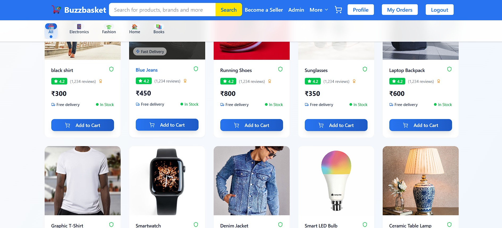

# 🛒 BuzzBasket – MERN Stack E-Commerce Platform

 <!-- Replace with your actual screenshot -->

**BuzzBasket** is a modern full-stack e-commerce application built using the **MERN stack** – MongoDB, Express.js, React.js, and Node.js. It supports shopping functionality including product browsing, cart management, authentication, order tracking, and an admin dashboard.

---

## 🚀 Live Demo

- 🔗 **Frontend**: [https://ecommerce-shop-5ngu.vercel.app/](https://ecommerce-shop-5ngu.vercel.app/)
- 🔗 **Backend**: Hosted on Render (API secured)

---

## 🧰 Tech Stack

- **Frontend**: React.js, Vite, Tailwind CSS  
- **Backend**: Node.js, Express.js  
- **Database**: MongoDB (Mongoose)  
- **Authentication**: JWT  
- **Image Upload**: Cloudinary + Multer  
- **Deployment**: Vercel (Frontend), Render (Backend)

---

## 📦 Features

### 👤 User
- Product browsing & filtering  
- Add/remove from cart  
- Checkout and place orders  
- User login/register  
- View order history and profile  

### 🛠️ Admin
- Admin dashboard  
- Add, edit, and delete products  
- Manage all user orders  

---

## ⚙️ Setup Instructions

### 🔧 Prerequisites

- Node.js and npm  
- MongoDB Atlas or local MongoDB  
- Cloudinary account (for image hosting)  

### 🔧 Backend Setup

```bash
cd server
npm install
npm run dev
